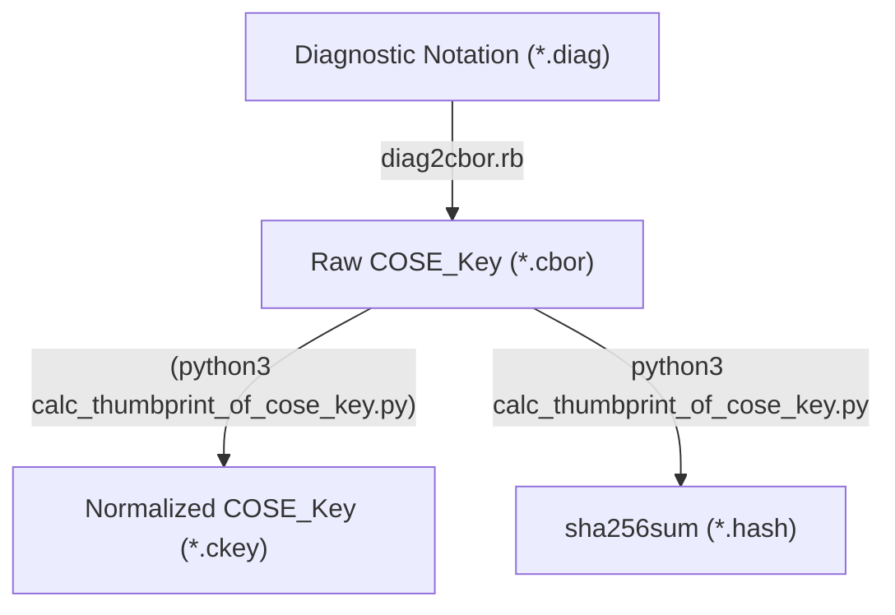

# Thumbprint of COSE_Key Calculator
This tool validates the thumbprint in [draft-isobe-cose-key-thumbprint](https://datatracker.ietf.org/doc/html/draft-isobe-cose-key-thumbprint).

## Install
- `make` and `git`
- `python3` and cbor2 lib (`$ pip install cbor2`)
- `ruby` and cbor2diag tool (`$ gem install cbor`)

```
$ git clone https://github.com/kentakayama/cose-key-thumbprint.git
$ cd cose_key_thumbprint
```

## Usage
Calculating and printing COSE_Key Thumbprint:
```
$ make test                   # generate and print sha256sum
Calculated thumbprint of EC2 P-256 Public key
===Thumbprint===
xxd -p -c 64 ec2_p256.hash
496bd8afadf307e5b08c64b0421bf9dc01528a344a43bda88fadd1669da253ec
================
Calculated thumbprint of AES128 Secret key
===Thumbprint===
xxd -p -c 64 aes128.hash
a2415ba0fc101d948490e9434e19e8b94172f5432b4dc924db6eddcfbc2577ed
================

$ cbor2diag.rb ec2_p256.ckey  # print normalized COSE_Key
{1: 2, -1: 1, -2: h'65EDA5A12577C2BAE829437FE338701A10AAA375E1BB5B5DE108DE439C08551D', -3: h'1E52ED75701163F7F9E40DDF9F341B3DC9BA860AF7E0CA7CA7E9EECD0084D19C'}

$ cbor2diag.rb aes128.ckey    # print normalized COSE_Key
{1: 4, -1: h'849B5786457C1491BE3A76DCEA6C4271'}
```
or
```
$ make ec2_p256.cbor          # generate COSE_Key fron diagnostic notation
$ python3 ./calc_thumbprint_of_cose_key.py ec2_p256.cbor - -f hex
496bd8afadf307e5b08c64b0421bf9dc01528a344a43bda88fadd1669da253ec
```

## How it works

