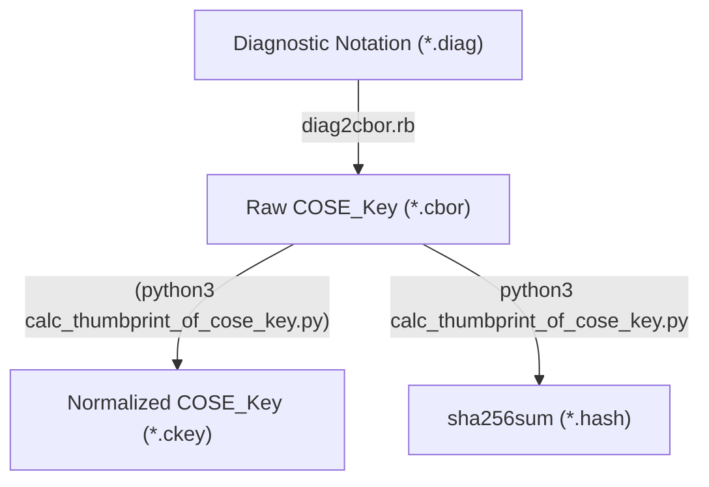

# Thumbprint of COSE_Key Calculator
See draft-isobe-cose-key-thumbprint.

## Install
- `make` and `git`
- `python3` and cbor2 lib (`$ pip install cbor2`)
- `ruby` and cbor2diag tool (`$ gem install cbor`)

```
$ git clone https://github.com/kentakayama/cose_key_thumbprint.git
$ cd cose_key_thumbprint
```

## Usage
Calculating and printing COSE_Key Thumbprint:
```
$ make test                   # generate and print sha256sum
$ cbor2diag.rb ec2_p256.ckey  # print normalized COSE_Key
$ cbor2diag.rb aes128.ckey    # print normalized COSE_Key
```
or
```
$ make ec2_p256.cbor          # generate COSE_Key fron diagnostic notation
$ python3 ./calc_thumbprint_of_cose_key.py ec2_p256.cbor - -f hex
```

## How it works

