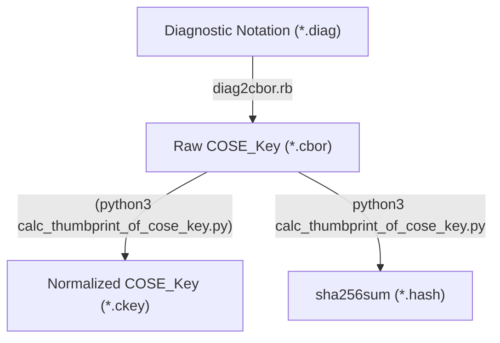

# COSE_Key Thumbprint Calculator
This tool validates the thumbprint in [draft-isobe-cose-key-thumbprint](https://datatracker.ietf.org/doc/html/draft-isobe-cose-key-thumbprint).

## Install
- `make` and `git`
- `python3` and [cbor2](https://pypi.org/project/cbor2/) lib ( `$ pip install cbor2` )
- `ruby` and [cbor-diag](https://rubygems.org/gems/cbor-diag/) tool ( `$ gem install cbor-diag` )

```
$ git clone https://github.com/kentakayama/cose-key-thumbprint.git
$ cd cose_key_thumbprint
```

## Usage
Calculating and printing COSE_Key Thumbprint:
```
$ make test                   # generate and print sha256sum
Calculated thumbprint of EdDSA Ed25519 Public key
===To Be hashed COSE_Key===
a301012006215820d75a980182b10ab7d54bfed3c964073a0ee172f3daa62325
af021a68f707511a
===Thumbprint===
866eefbd6718c8846cd7ddfe43fc74ab1daac4538ff8514ea2ec2d410a415743
================

Calculated thumbprint of EC2 P-256 Public key
===To Be hashed COSE_Key===
a40102200121582065eda5a12577c2bae829437fe338701a10aaa375e1bb5b5d
e108de439c08551d2258201e52ed75701163f7f9e40ddf9f341b3dc9ba860af7
e0ca7ca7e9eecd0084d19c
===Thumbprint===
496bd8afadf307e5b08c64b0421bf9dc01528a344a43bda88fadd1669da253ec
================

Calculated thumbprint of RSA2048 Public key
===To Be hashed COSE_Key===
a3010320590100b7a43c3d64a2d5d9098fd8533fc84d60596f69d33b0df956f6
659ea4e26127aeb0ee7ca82b580f36a14c4904723b5db91a9f93124a1d856af4
8ae8e31d5c7b05c5749654b8c390021a03eb70077a65c491d3e22aa26f9015c3
4ff128e0d3ce8cc28a9053f2d8cb0940199db5592752fcf111c861623678f741
094ef189ece630ad2c24702c72f43dbd5f12fe3902e448b947d570fc92056627
0f21b1be36060d233e02a592f73210d998a5813f86a949a2a60d17382d02736d
2b80b7b6ca62c78e91dc88229501b639f8bdf6fa549e64ef8eb3a535e7f697ae
4f46c3c70f51a5f5fc8f2c2c6b9289576ddc2fc59f63d9dd9f22ef8e053c5186
706d6ab365b3f92143010001
===Thumbprint===
120e976e0208c57c9cc7c92e548317c9551c1f0ede5d4680119c4d7757503f39
================

Calculated thumbprint of AES128 Secret key
===To Be hashed COSE_Key===
a201042050849b5786457c1491be3a76dcea6c4271
===Thumbprint===
a2415ba0fc101d948490e9434e19e8b94172f5432b4dc924db6eddcfbc2577ed
================

$ cbor2diag.rb ec2_p256.ckey  # print normalized COSE_Key
{1: 2, -1: 1, -2: h'65EDA5A12577C2BAE829437FE338701A10AAA375E1BB5B5DE108DE439C08551D', -3: h'1E52ED75701163F7F9E40DDF9F341B3DC9BA860AF7E0CA7CA7E9EECD0084D19C'}
```
or
```
$ make ec2_p256.cbor          # generate COSE_Key fron diagnostic notation
$ python3 ./calc_thumbprint_of_cose_key.py ec2_p256.cbor - -f hex
496bd8afadf307e5b08c64b0421bf9dc01528a344a43bda88fadd1669da253ec
```

Validating COSE_Key hash from other sources
```
$ make validate               # validate generated COSE_Key Thumbprints
Validate ec2_p256.hash
496bd8afadf307e5b08c64b0421bf9dc01528a344a43bda88fadd1669da253ec
496bd8afadf307e5b08c64b0421bf9dc01528a344a43bda88fadd1669da253ec
[VALID] EC2 COSE_Key Thumbprint matches

Validate rsa2048.hash
120e976e0208c57c9cc7c92e548317c9551c1f0ede5d4680119c4d7757503f39
120e976e0208c57c9cc7c92e548317c9551c1f0ede5d4680119c4d7757503f39
[VALID] RSA COSE_Key Thumbprint matches

[OK] All COSE_Key Thumbprints are valid
```

## How it works


## License and Copyright
BSD 2-Clause License

Copyright (c) 2023 SECOM CO., LTD. All Rights reserved.

Redistribution and use in source and binary forms, with or without
modification, are permitted provided that the following conditions are met:

1. Redistributions of source code must retain the above copyright notice, this
   list of conditions and the following disclaimer.

2. Redistributions in binary form must reproduce the above copyright notice,
   this list of conditions and the following disclaimer in the documentation
   and/or other materials provided with the distribution.

THIS SOFTWARE IS PROVIDED BY THE COPYRIGHT HOLDERS AND CONTRIBUTORS "AS IS"
AND ANY EXPRESS OR IMPLIED WARRANTIES, INCLUDING, BUT NOT LIMITED TO, THE
IMPLIED WARRANTIES OF MERCHANTABILITY AND FITNESS FOR A PARTICULAR PURPOSE ARE
DISCLAIMED. IN NO EVENT SHALL THE COPYRIGHT HOLDER OR CONTRIBUTORS BE LIABLE
FOR ANY DIRECT, INDIRECT, INCIDENTAL, SPECIAL, EXEMPLARY, OR CONSEQUENTIAL
DAMAGES (INCLUDING, BUT NOT LIMITED TO, PROCUREMENT OF SUBSTITUTE GOODS OR
SERVICES; LOSS OF USE, DATA, OR PROFITS; OR BUSINESS INTERRUPTION) HOWEVER
CAUSED AND ON ANY THEORY OF LIABILITY, WHETHER IN CONTRACT, STRICT LIABILITY,
OR TORT (INCLUDING NEGLIGENCE OR OTHERWISE) ARISING IN ANY WAY OUT OF THE USE
OF THIS SOFTWARE, EVEN IF ADVISED OF THE POSSIBILITY OF SUCH DAMAGE.
